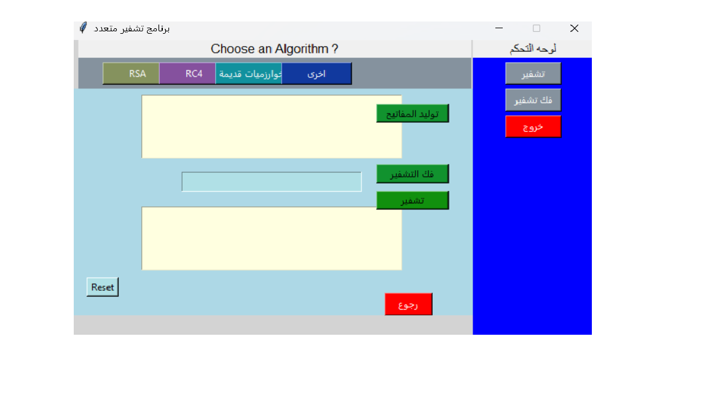
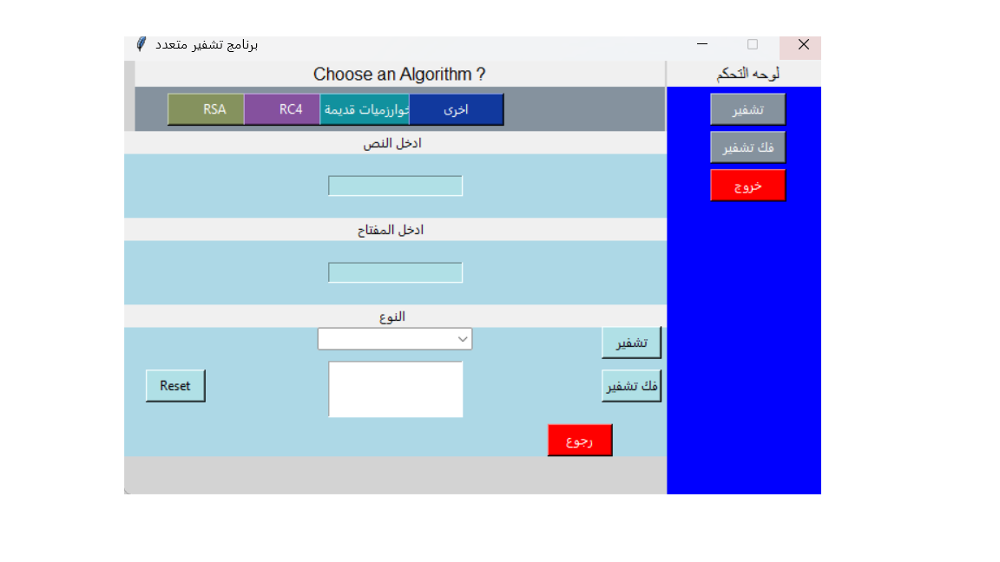
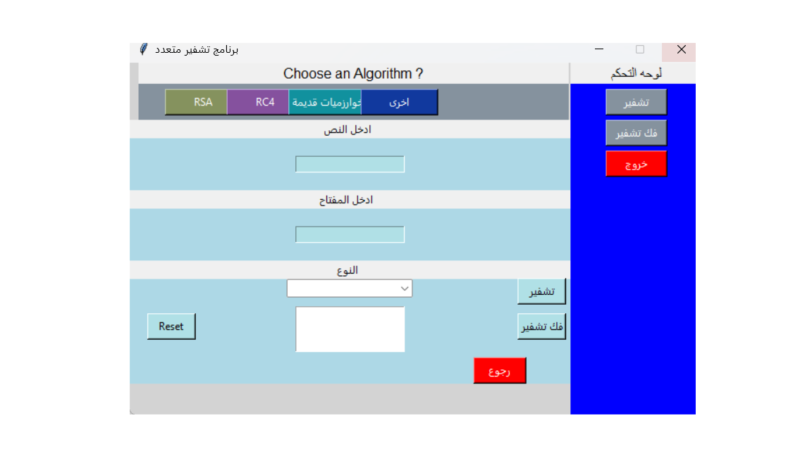

# Python Encryption Toolkit | برنامج تشفير بايثون



---

## English Version

### Overview
The **Python Encryption Toolkit** is a Python-based application that allows users to encrypt and decrypt messages using multiple algorithms. It supports RSA, RC4, and classic encryption methods like Additive (Caesar), Multiplicative, and Keyless (Railway/Zigzag). The program is user-friendly and supports both English and Arabic messages.

### Features
- **RSA Encryption**: Generate keys, encrypt, and decrypt messages.
- **RC4 Encryption**: Symmetric key encryption.
- **Classic Algorithms**: Additive (Caesar), Multiplicative, Keyless (Railway/Zigzag).
- **Multi-language support**: Encrypt messages in Arabic and English.
- **User-friendly GUI**: Developed using Python Tkinter.
- **Reset and Clear Functions**: Easily reset input fields and outputs.
- **Future Feature**: Load images for encryption.

## Demo

Insert gif or link to demo

[Demo Link](https://abdulkaree4m.github.io/python-encryption-toolkit/)





### Installation & Usage
1. Clone the repository:
2. 
## Installation | التثبيت
1. انسخ المستودع إلى جهازك:
```bash
git clone https://github.com/abdulkaree4m/python-encryption-toolkit.git
cd python-encryption-toolkit


